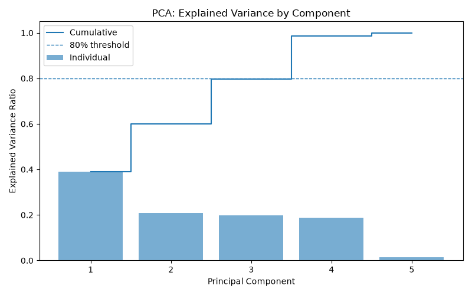

# 🛍️ Retail Customer Segmentation

Unsupervised customer segmentation on 1,000 retail transactions using **StandardScaler → PCA → K-Means**, turning raw sales data into four business-ready customer personas.

> 📊 [**View the full interactive report**](./Retail_Customer_Segmentation_Report.html) · 📓 [Jupyter Notebook](./Retail_Sales_Segmentation.ipynb)


---

## 📌 Business Problem

A retailer has 1,000 transactions and no formal way to tell which customers matter most, what they buy, or how to talk to them — every customer gets the same marketing. This project segments customers into distinct, interpretable groups using unsupervised machine learning (no labels, no surveys — just transaction data) and turns each group into a persona the business can act on.

**Headline finding:** just **21.5%** of customers generate **64.4%** of revenue.

---

## 🧪 Methodology

| Step | What happens |
|---|---|
| 1. Clean | Check nulls/duplicates, drop identifier columns |
| 2. Scale | `StandardScaler` — mean 0, std 1 across all features |
| 3. Reduce | `PCA` compresses features into 2–3 components for visualization |
| 4. Choose K | Elbow method + silhouette score across K = 2–10 |
| 5. Cluster | `KMeans(n_clusters=4, random_state=42, n_init=10)` |
| 6. Profile | Aggregate each cluster into a readable customer persona |

---

## 🧮 Feature Scaling & PCA

Age ranges from 18–70. Total Amount ranges from $25–$2,000. Left unscaled, K-Means would treat spend as far more "important" than age purely because of its bigger numbers — not because it actually matters more.

**`StandardScaler`** fixes this by transforming every numeric feature to mean 0, std 1, so Age, Quantity, Price per Unit, and Total Amount all get an equal vote in the distance calculation K-Means relies on.

**`PCA`** then rotates the scaled data onto new axes — principal components — ranked by how much variance (information) each one captures, so the segments can be visualized in 2D/3D without losing the underlying structure.

<p align="center">
  
</p>
<p align="center"><em>PCA explained variance by component — the first 2 components capture 60.1% of total variance, the first 3 capture 79.8%.</em></p>

**What's actually driving the split:** PC1 loads heavily on `Total Amount` (0.698) and `Price per Unit` (0.639) — it's essentially a "spend axis." This is why the clusters separate left-to-right in the scatter plots below: price tier, more than anything else, defines the segments.

---

## 📉 Choosing K

K-Means needs to be told how many clusters to find — it won't discover that number on its own. Two diagnostics were used together:

- **Elbow method** — plots inertia (cluster tightness) against K. Inertia always drops as K increases, so the goal is finding the point where adding more clusters stops helping much. That bend sits around K=4–5.
- **Silhouette score** — measures how well separated clusters are (−1 to 1, higher is better). It's technically highest at K=2 (0.316), but that only splits customers into "big spenders vs. everyone else" — not useful for targeting.

<p align="center">
  
</p>
<p align="center"><em>Inertia (elbow) vs. silhouette score across K=2–10.</em></p>

**Why K=4 over the statistically "best" K=2:** K=4 sits right at the elbow, keeps a reasonable silhouette score (0.252), and — most importantly — produces four segments that map cleanly onto real business personas rather than a statistically optimal but meaningless split.

---

## 🗺️ Cluster Visualization

With K=4 chosen, K-Means was fit on the scaled data and the resulting labels projected back onto the PCA axes for visualization.

<p align="center">
  
</p>
<p align="center"><em>The four clusters in 2D PCA space — clean vertical bands driven mostly by PC1, the "spend axis."</em></p>

<p align="center">
  
</p>
<p align="center"><em>The same segments in 3D PCA space (PC1 + PC2 + PC3 = 79.8% of total variance).</em></p>

---

## 📊 Cluster Profiles

Every transaction now carries a cluster label. Aggregating by cluster turns abstract math into a business-readable profile — average spend, age, quantity, and category mix per segment.

<p align="center">
  
</p>
<p align="center"><em>Average total spend, average age, and category mix by cluster.</em></p>

**The headline insight:** Cluster 3 is only 21.5% of the customer base but drives 64.4% of total revenue. Cluster 0, by contrast, is the largest group (31.5%) but contributes just 3.6% — a textbook Pareto pattern.

---

## 👥 Customer Personas

| Cluster | Persona | Avg Spend | Avg Qty | % of Customers | % of Revenue |
|---|---|---:|---:|---:|---:|
| C0 | Budget Browsers | $53 | 1.5 | 31.5% | 3.6% |
| C1 | Premium Occasional | $604 | 1.5 | 18.1% | 24.0% |
| C2 | Frequent Value Shoppers | $127 | 3.6 | 28.9% | 8.0% |
| C3 | **VIP High-Value** | **$1,366** | 3.5 | 21.5% | **64.4%** |

---

## 🗂️ Repo Structure

```
retail-customer-segmentation/
├── Retail_Sales_Segmentation.ipynb      # full analysis notebook
├── Retail_Customer_Segmentation_Report.html   # standalone visual report
├── data/
│   ├── retail_sales_dataset.csv          # raw input
│   └── customers_with_clusters.csv       # output with cluster labels
├── output/
│   ├── cluster_profile_summary.csv
│   ├── cluster_category_split.csv
│   └── cluster_gender_split.csv
├── assets/                               # chart images used in this README
├── README.md
└── requirements.txt
```

## ⚙️ Run it locally

```bash
git clone https://github.com/<your-username>/retail-customer-segmentation.git
cd retail-customer-segmentation
pip install -r requirements.txt
jupyter notebook Retail_Sales_Segmentation.ipynb
```

`requirements.txt`
```
pandas
numpy
scikit-learn
matplotlib
seaborn
jupyter
```

---

## 🔍 Limitations & Future Work

- `Transaction ID` was unintentionally included as a numeric clustering feature via `select_dtypes(include='number')` — a v2 should explicitly exclude identifier columns.
- Silhouette score (0.252) reflects realistic overlap in retail behavior data — clusters are meaningful but not perfectly separated.
- No recency/frequency-over-time signal exists in this snapshot; a proper **RFM** (Recency, Frequency, Monetary) feature set and a DBSCAN/hierarchical cross-check are the natural next steps.

---

## 🛠️ Tech Stack

`Python` · `pandas` · `NumPy` · `scikit-learn` (`StandardScaler`, `PCA`, `KMeans`, `silhouette_score`) · `matplotlib` · `seaborn`
